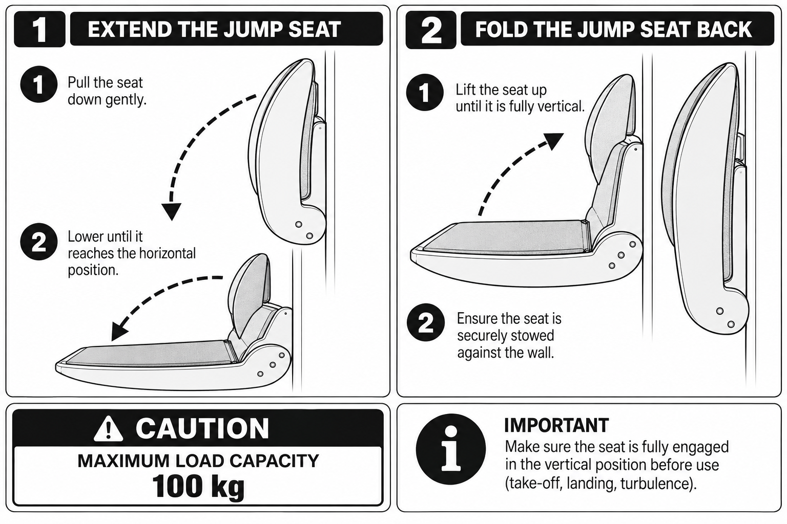

The jump seat is a fold-down seat mounted on the wall. It is stowed vertically against the wall when not in use and extended to the horizontal position for occupancy.

:::caution
Maximum occupant weight is **100 kg**. The seat is not occupied by more than one person.
:::

## Extending the jump seat

1. Pull the seat down gently. The seat pivots away from the wall.
2. Lower the seat until it reaches the horizontal position. The seat comes to rest at its travel stop and carries the occupant.

## Folding the jump seat back

1. Lift the seat up until it is fully vertical.
2. Confirm the seat is stowed against the wall. The seat stays vertical without being held.

:::note
The seat is confirmed fully engaged in the vertical position before use.

TODO(łukasz): the source diagram qualifies this with "take-off, landing, turbulence". Confirm which
phases apply to this FNPT device, or whether the wording is carried over from the aircraft manual.
:::

TODO(łukasz): confirm the seat position on the device, the restraint type (if any) and whether the
seat is fitted to every serial number — `component.yaml` currently carries a placeholder location.
