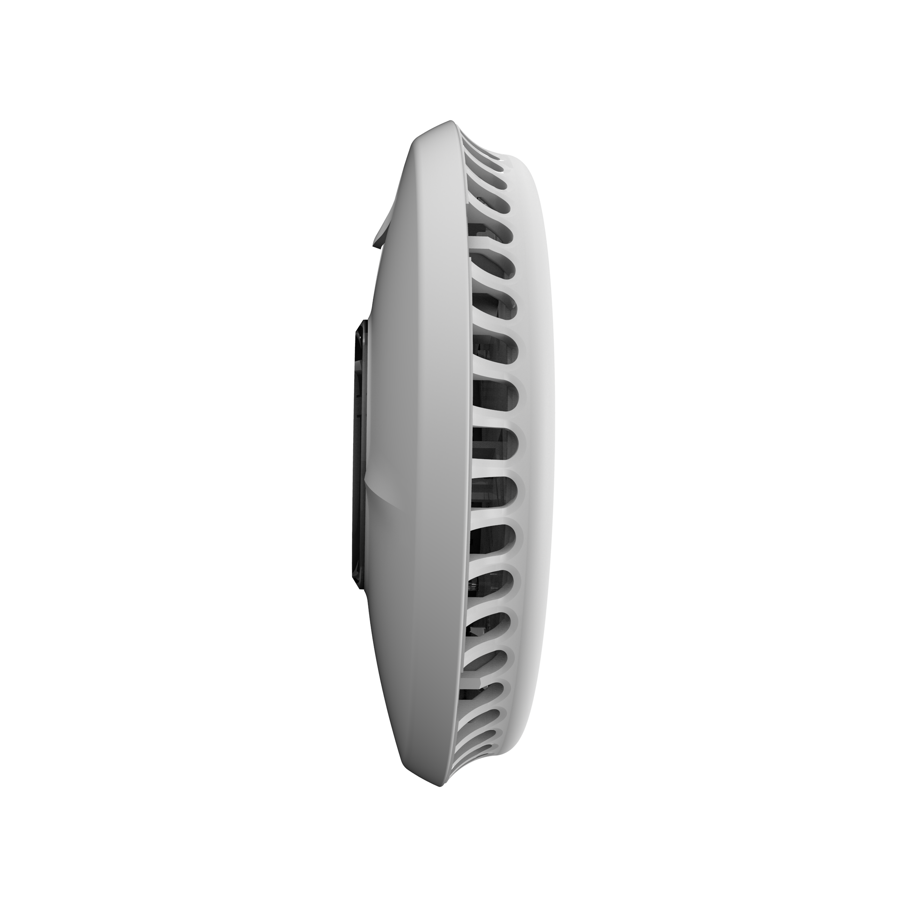
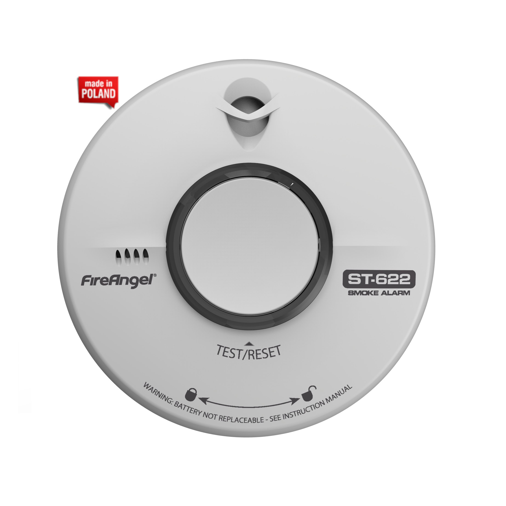
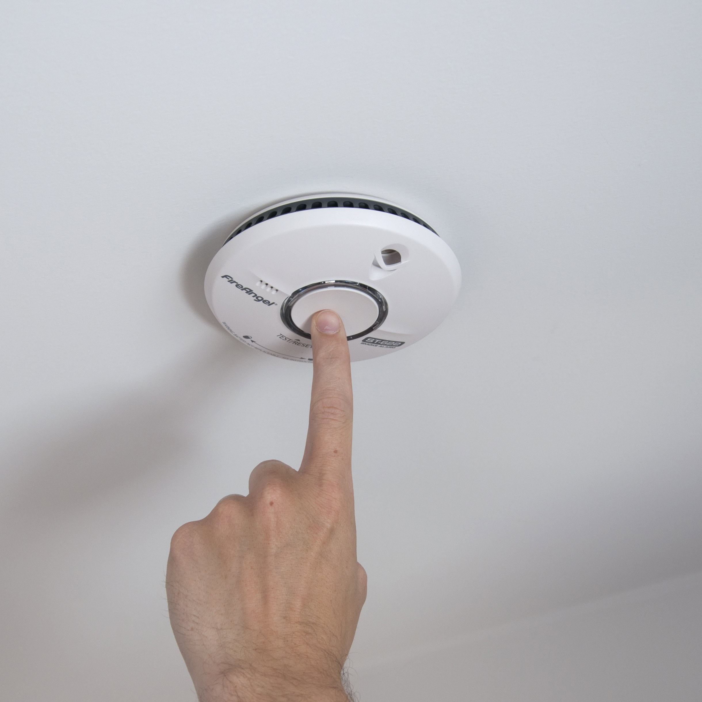
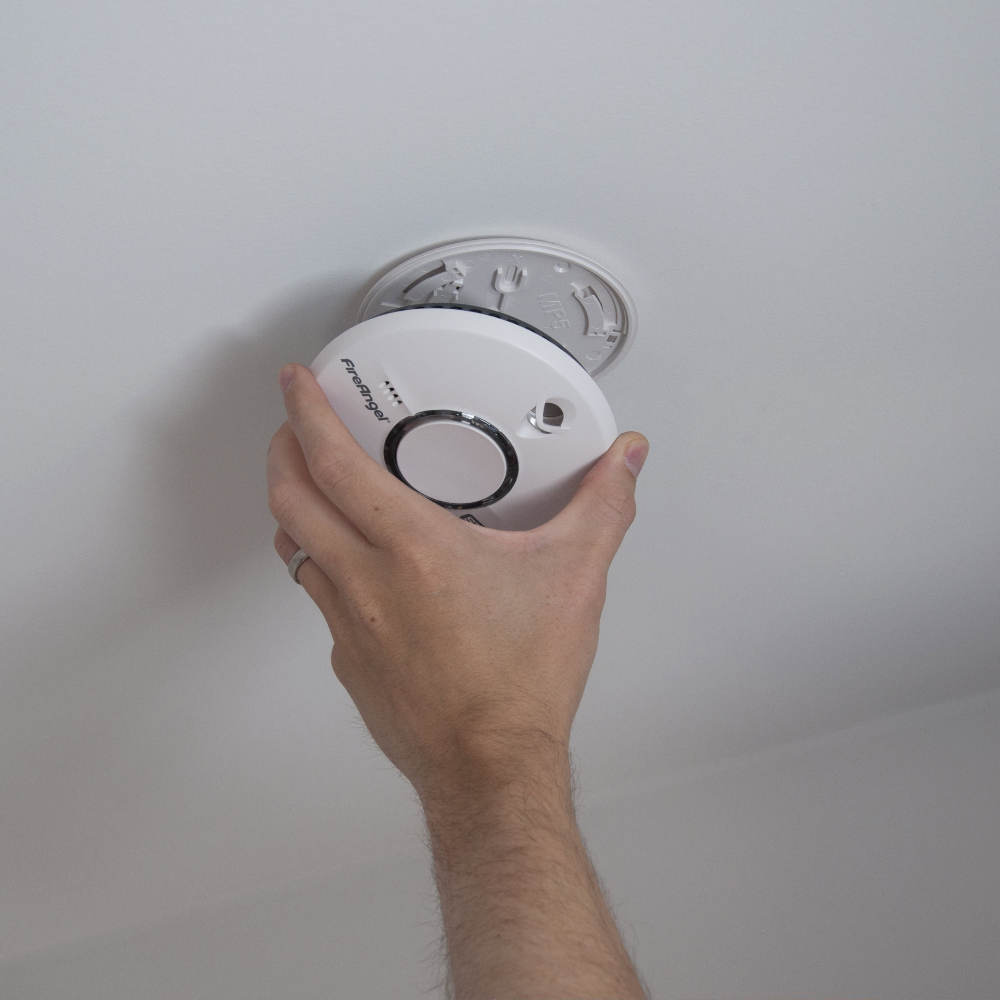

import { ManualHeader, ManualFooter } from "@site/src/components/ManualPage";

<ManualHeader manual={"FCOM"} serial={"B73M/F2M/04/2026"} issue={1} revision={1} chapter={"FNPT operations"} section={"Smoke Detector"} effective={"2026-08-27"} />

:::info[Effectivity]
Component **`smoke-detector`** · installed software **1.0.0** · documented range `>=1.0.0 <2.0.0` · chunk revision `2d0912f` (2026-08-27)
:::

import SmokeAlarmSignal from "@site/src/components/SmokeAlarmSignal";

A smoke alarm is fitted to the ceiling of the IOS. The unit is a FireAngel ST-622, a stand-alone smoke alarm certified to EN 14604:2005 + AC:2008. It works on its own: it is not interconnected with other alarms and it drives no other equipment in the trainer.

| Property | Value |
| --- | --- |
| Sensor | Optical smoke sensor with thermal enhancement (Thermoptek) |
| Sound output | 85 dB at 3 m |
| Power | Integrated lithium battery, 10-year service life, neither charged nor replaced |
| Operating temperature | 4 °C to 38 °C |
| Operating humidity | 0 % to 93 % RH, non-condensing |
| Diameter / depth | 130 mm / 34 mm |
| Mass | 162 g |

The unit is a flat circular alarm with a single centre button that serves as both the test and the silence control, and a red LED beside it.

TODO(łukasz): the photographs above are the manufacturer's product images. A photograph of the unit
as installed on the IOS ceiling of this device is still required, and manufacturer images should be
cleared for use in a controlled document or replaced with our own.

:::caution
The manufacturer states that the ST-622 is not intended for non-residential, commercial or industrial premises. TODO(łukasz): confirm with the fire-safety inspection that this alarm satisfies the requirements for the training room, or record which detector replaces it.
:::

## Operation

Under normal conditions the red LED on the front of the alarm flashes once every 40 seconds. This indicates that the unit is activated and watching; no other indication is given.

Three audible signals are produced.

| Signal | Meaning |
| --- | --- |
| Loud repeated beeps with the red LED flashing rapidly | Smoke is detected. |
| Two cycles of three loud beeps, then silence | Answer to the Test button. |
| A single beep every 40 seconds | Battery low, or, if the red LED does not flash together with the beep, a fault. |

<SmokeAlarmSignal />

TODO(łukasz): the manufacturer documents neither the pulse pattern nor the tone frequency of the fire alarm signal itself, only that of the test answer. The values that drive the player are marked `UNCONFIRMED_` in `src/components/SmokeAlarmSignal.jsx` and need a measurement on the installed unit.

### If the alarm sounds

1. Evacuate everyone from the training room by the marked escape routes whenever the source of the smoke is not immediately obvious. The manufacturer states that no alarm is to be ignored.
2. TODO(łukasz): state the FTD order of actions before leaving the room — whether the device is shut down at the [Starting Panel](/manuals/b73m-f2m-04-2026/operations/starting-panel), whether an emergency stop is pressed, and who is alerted over the technician intercom.
3. TODO(łukasz): state who is authorised to declare the room safe and to return the alarm to service after a real activation.

:::caution
A single beep repeated every 40 seconds is not an evacuation signal. It reports a low battery or, when the red LED does not flash with the beep, a fault. A fault beep cannot be silenced; the unit is then replaced immediately, because it no longer protects the room.
:::

### Silencing an unwanted alarm

Cooking vapour, steam or dust can raise an unwanted alarm. The alarm is silenced from the Test / Silence button in the centre of the cover.

1. Press the Test / Silence button briefly and release it. The sounder stops after a short moment.
2. Observe the red LED. It flashes about once every 10 seconds, which indicates reduced sensitivity.
3. Leave the alarm alone for 10 minutes. Sensitivity is restored automatically and the red LED returns to one flash every 40 seconds.

:::note
A heavy concentration of smoke cannot be silenced. If the sounder continues after the button is pressed, the alarm is treated as a fire warning.
:::

:::note
The low-battery beep is silenced separately, for 8 hours at a time and at most 10 times, from the same button. Silencing the low-battery beep does not renew the battery and the unit still detects smoke during that period.
:::

## Maintenance

The alarm is a sealed device. The housing is not opened, and opening it voids the manufacturer warranty. The internal lithium battery is not rechargeable and not replaceable: it is switched on automatically when the alarm is locked onto its base plate and switched off automatically when the alarm is taken off the base plate.

:::caution
There is no battery change interval for this alarm. The battery lasts for the 10-year service life of the unit, after which the complete alarm is replaced. Any procedure that calls for opening the housing or fitting a cell is wrong for this device.
:::

TODO(łukasz): record the date on which this unit was first locked onto its base plate, and the resulting replacement due date, so that the 10-year life can be tracked per simulator.

TODO(łukasz): state who carries out the weekly test and the quarterly cleaning on an FTD device, and in which log the result is recorded.

### Weekly test of the audible alarm

The alarm is tested once a week.

1. Check that the alarm is fully engaged on its base plate. An alarm that is not correctly fitted has no power and does not answer the test.
2. Press the Test / Silence button firmly in the centre of the cover and release it.
3. Listen for the test signal. The sounder gives two cycles of three loud beeps and then stops automatically.
4. Check that the red alarm LED flashes rapidly while the signal sounds.
5. If no audible signal is produced, press the centre of the button again more firmly, then repeat the test.
6. If the alarm still produces no signal, report it as unserviceable. TODO(łukasz): state the FTD reporting route (DOK ticket, or the manufacturer support line printed in the ST-622 manual).

:::note
The Test button tests the smoke-detection circuit of the alarm. Testing with real smoke is neither required nor permitted.
:::

:::note
The test does not work while the alarm is in the reduced-sensitivity mode that follows a silenced alarm. In that case the test is repeated after 15 minutes.
:::

### Quarterly cleaning

The alarm is cleaned at least once every three months.

1. Warn everyone in the training room that the alarm may sound. Vacuum cleaning can raise a false alarm.
2. Vacuum the alarm through the smoke inlets with a soft brush nozzle.
3. Wipe the housing with a slightly damp cloth. Solvents and cleaning agents damage the sensor and the circuit, and are not used.
4. Check that the red LED still flashes once every 40 seconds.
5. Carry out the audible alarm test.

:::caution
The alarm is never painted. Paint blocks the smoke inlets and prevents smoke from reaching the sensor.
:::

### Removal from the ceiling mount

1. Support the body of the alarm with one hand.
2. TODO(łukasz): confirm the release action. The manufacturer manual documents fitting only; it does not state the direction in which the alarm is turned to release it from the base plate, nor whether a tamper-resistant tab has been broken out of the base plate on this installation.
3. Check that the alarm has separated from the base plate. The internal battery switches off automatically on removal, and any low-battery beep stops.

:::caution
An alarm that is off its base plate is dead. The room is unprotected until the alarm is refitted and tested.
:::

### Refitting to the ceiling mount

1. Align the three hooks on the back of the alarm with the ends of the three slots in the base plate. The alarm engages in any orientation.
2. Turn the alarm clockwise until it locks. Check that it is firmly seated.
3. Wait 5 seconds for the alarm to settle. The red LED starts to flash every 40 seconds, which indicates that the internal battery has been activated.
4. Carry out the audible alarm test.

### Disposal

The alarm is electrical waste under directive 2012/19/EU and is not disposed of with ordinary waste. The battery is separated from the detector before disposal and both parts are disposed of according to local regulations. The unit is neither opened nor burned.

## Related

- [Emergency Stop Switches](/manuals/b73m-f2m-04-2026/operations/emergency-stop) — the emergency stops and the other safety equipment of the IOS.

## Sources

- FireAngel ST-622-PL user manual (Sprue Safety Products Ltd), `https://fireangel-polska.pl/wp-content/uploads/2018/02/Instrukcja-FireAngel-ST-622.pdf` — indications, test, silence functions, maintenance, disposal.
- FireAngel ST-622 datasheet (Termasol Sp. z o.o.), `https://fireangel-polska.pl/wp-content/uploads/2017/12/karta_katalogowa_fireangel_ST-622.pdf` — sound output, dimensions, mass, temperature and humidity ranges, battery, certification.

<ManualFooter serial={"B73M/F2M/04/2026"} issue={1} revision={1} sectionId={"smoke-detector"} client={"TFC European Airline Services GmbH"} />
