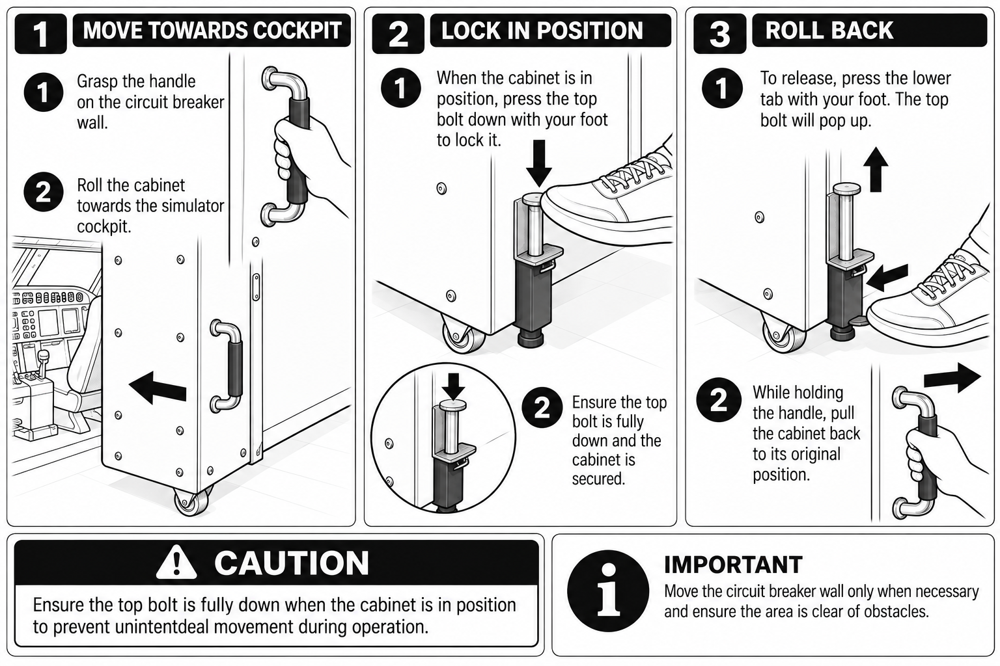

import { ManualHeader, ManualFooter } from "@site/src/components/ManualPage";

<ManualHeader manual={"FCOM"} serial={"B73M/F2M/04/2026"} issue={1} revision={1} chapter={"Systems description"} section={"Circuit Breaker Wall"} effective={"2026-08-27"} />

:::info[Effectivity]
Component **`circuit-breaker-wall`** · installed software **1.0.0** · documented range `>=1.0.0 <2.0.0` · chunk revision `uncommitted` (—)
:::

The circuit breaker wall is a cabinet on castors. It is rolled towards the simulator cockpit for access and locked in place with a foot-operated bolt, then released and returned to its original position afterwards. A handle on the face of the cabinet is used for both movements.

:::note
The circuit breaker wall is moved only when necessary, and the area is confirmed clear of obstacles before it is moved.
:::

## Moving the wall towards the cockpit

1. Confirm the area between the cabinet and the cockpit is clear.
2. Grasp the handle on the circuit breaker wall.
3. Roll the cabinet towards the simulator cockpit. The cabinet runs on castors and needs no lifting.

## Locking the wall in position

1. With the cabinet in position, press the top bolt down with the foot. The bolt extends to the floor and takes the weight off the castors.
2. Confirm the top bolt is fully down and the cabinet is secured. The cabinet does not move when pushed by hand.

:::caution
The top bolt is fully down whenever the cabinet is in position. A cabinet left on its castors can move unintentionally during operation.
:::

## Returning the wall to its original position

1. Press the lower tab with the foot to release the bolt. The top bolt pops up and the cabinet returns to its castors.
2. Holding the handle, pull the cabinet back to its original position.
3. Confirm the cabinet is fully back and the access route is clear.

## Related

- [Emergency Stop Switches](/manuals/b73m-f2m-04-2026/operations/emergency-stop) — the emergency stop switches remain accessible with the wall in either position.

TODO(łukasz): confirm whether the cabinet is locked in its stowed position as well as in the access
position, and whether any interlock prevents operation while it is unlocked.

TODO(łukasz): the source FCOM states that a dummy fire extinguisher is mounted on the circuit breakers
wall and must not be used in an emergency. Confirm whether it is still fitted on this device, and
whether it should be documented here or as its own component.

TODO(łukasz): the caution in the supplied artwork reads "unintentdeal movement" — the wording above is
corrected. Update the artwork so the figure and the text agree.

<ManualFooter serial={"B73M/F2M/04/2026"} issue={1} revision={1} sectionId={"circuit-breaker-wall"} client={"TFC European Airline Services GmbH"} />
